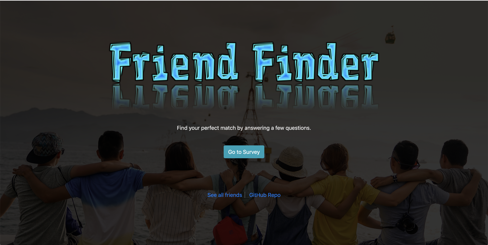

# Friend-Finder

## About the app

* This is a full-stack match finding app where you answer a list of questions in a survey and on submission of your answers, a person with similar answers to yours is shown to you as your "Best Match".

* The app calculates the difference between each answer of yours to the answer of the people who have taken the survey earlier for the respective questions, and then adds the difference of each answer.

* After adding the differences, the person with the lowest difference to your answers is the best match.

## Technologies used

* HTML5

* CSS3

* Bootstrap 4

* JavaScript

* jQuery

* Node.js

* Express

* MySQL

## System Requirements

* Node.js - version 10 and up

* MySQL - version 8.0 

## Things to do after cloning this repository

* Navigate to the root of this app's folder and run `npm install` in your terminal.

* This should install the required packages for this app mentioned in the `package.json` file

* Create a `.env` file in the root folder and paste the following inside it

	`DB_USER=root
	 DB_HOST=localhost
	 DB_PASS=MySQL password
	 DB_NAME=friend_finder_db`

where `DB_PASS` is your MySQL connection password.

* **Setting up the database**

	* Navigate to the `db` folder from your terminal and run `source schema.sql` followed by `source seeds.sql`

## Running the app

* Navigate back to the root of the folder in your terminal and run `node server.js`

* Running this should show you `listening on 3001` in your terminal.

* Now, in your browser go to `http://localhost:3001` and you have the Friend Finder App running on your computer.

